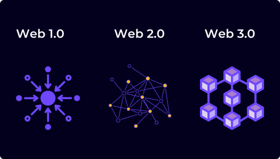

## FreeMint社群
<!--🌹FreeMintDao | AdogeCoin | NFT  -->

- 💪聚焦白名单、空投、撸毛，TO THE MOON

- 👨‍❤️‍👨我们是Web3农民工，图狗

<!--  
 

 -->

 

 

<!-- 
    👀 本站总访问量： 次

    | 🚴‍♂️ 本站总访客数： 人
 -->

 

[我的藏品](https://tianyuan.eth.xyz)
[交易记录](https://etherscan.io/address/tianyuan.eth)
[OpenSea](https://opensea.io/0xadoge)
[开始阅读](/README.md)

<!-- 背景色 -->

